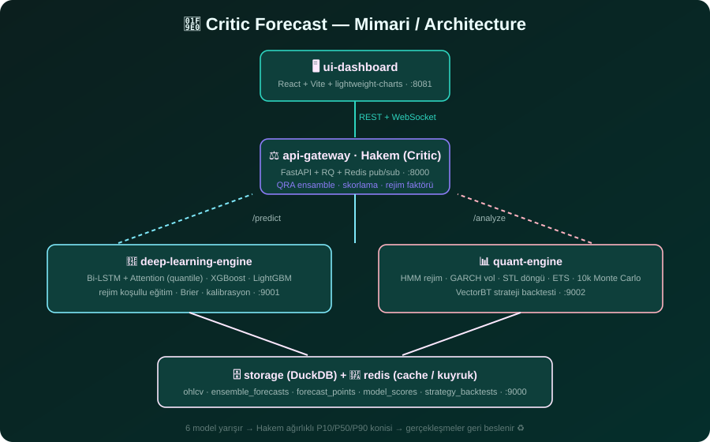

# 🧠 Critic Forecast — Çok Modelli Hakem Sistemi

> **"6 model yarışır, 1 hakem karar verir, piyasa söyler!"** 🏆
>
> Fully local (no LLM API), multi-model financial forecasting platform with a **Critic (referee) engine** that blends 6 competing models into one probabilistic cone — and learns from **what actually happened** next.



---

## 🚀 Ne Bu? / What is this?

| 🇹🇷 Türkçe | 🇬🇧 English |
|---|---|
| Kripto + hisse + emtia için **tahmin konisi** (P10/P50/P90) üreten, tamamen Docker'da çalışan, ücretsiz veri kaynaklı bir platform. 6 model paralel çalışır; **Hakem Motoru** bunları tarihsel gerçekleşmelere göre ağırlıklandırır; strateji backtest'leri ve gelecek simülasyonu yaparsın. | Generates **forecast cones** (P10/P50/P90) for crypto, stocks & commodities — fully containerized, free data sources. 6 models race in parallel; the **Critic engine** weights them by realized outcomes; then you can backtest strategies and run future simulations. |

## ✨ Özellikler / Features

- 🤖 **6 rakip model**: Bi-LSTM+Attention (quantile heads), XGBoost, LightGBM, Monte Carlo (HMM+GARCH), STL döngüsellik, ETS baseline
- ⚖️ **Hakem (Critic) Motoru**: softmax + rejim faktörü + **QRA (Quantile Regression Averaging)** — ağırlıklar gerçekleşmiş sonuçlardan LP ile öğrenilir (≥30 gerçekleşme)
- 🎯 **Dürüst metrikler**: F1/calibration/Brier gerçekleşmelerden; walk-forward değerlendirme; sahte skor yok 😉
- 🧪 **Strateji Laboratuvarı (VectorBT)**: Koni Trend, Koni Kırılımı, Rejim Anahtarı + fee/slippage/risk kontrolleri + `signal_source` ile "hangi modeli dinleseydik?" testi
- 📈 **Simülasyon Merkezi**: fan chart (P5–P95), olasılık hesap makinesi ("30 günde fiyat X üstünde mi?"), senaryo tablosu, VaR/CVaR
- 🔄 **Backfill (Geçmiş Koni Üretimi)**: geçmiş günler için look-ahead'siz tahmin yeniden üretimi → backtest kapsamı gerçek seviyeye çıkar
- ⏰ **Scheduler**: her gün canlı tahmin, her Pazar koni tazeleme + tam-kalite geçişi (kendi kendine yaşayan sistem 🧟✨)
- 💾 **DuckDB + Redis**: analitik depo + job kuyruğu; kayıtlı tahminler önbellekte

## 🏗️ Mimari / Architecture

```
🖥️ ui-dashboard (React + Vite + lightweight-charts)  :8081
        │  REST + WebSocket
⚖️ api-gateway (FastAPI + RQ + Redis)  ── Hakem Motoru (QRA + skorlama)  :8000
        ├── 🔮 deep-learning-engine (Bi-LSTM | XGBoost | LightGBM)  :9001
        └── 📊 quant-engine (HMM | GARCH | STL | ETS | MC | VectorBT)  :9002
🗄️ storage (DuckDB) :9000  ·  🧺 redis (cache / kuyruk)  ·  👷 worker ×2  ·  ⏰ scheduler
```

**Akış / Flow:**
1. 🎯 Varlık seç → 6 model paralel eğitilir (veri: Binance/Yahoo, DuckDB cache)
2. ⚖️ Hakem, walk-forward hataları + rejim + kalibrasyona göre ağırlık verir (QRA aktifse LP çözümü)
3. 🎨 P10/P50/P90 **tahmin konisi** + yükseliş olasılığı WebSocket ile UI'a akar
4. ♻️ Gerçekleşen fiyatlar sonraki tahminlerde skorlara geri beslenir — sistem kendini düzeltir

## 🚀 Hızlı Başlangıç / Quick Start

```bash
cp .env.example .env          # isteğe bağlı ayarlar
docker compose up --build     # tüm servisler ayağa kalkar
```

| Nereye? | Adres |
|---|---|
| 🖥️ Panel / Simülasyon / Geçmiş | http://localhost:8081 |
| 📚 API + Swagger | http://localhost:8000/docs |
| 🩺 Sağlık kontrolü | http://localhost:8000/api/health |

> 💡 İpucu: `worker` imajı ayrı build edilir — değişiklik sonrası `docker compose up -d --build worker worker-2`.
> Storage şema değişikliği sonrası: `docker compose up -d --force-recreate storage`.

## 🔬 Backtest Nasıl Çalışır?

- Sinyal kaynakları: `ensemble` (hakem konisi) veya 6 modelden biri (`signal_source`)
- Maliyet & risk: `fee_mode`, `fees`, `slippage_bps`, `max_position`, `max_trades_per_month`
- Çıktılar: toplam getiri, Sharpe/Sortino/Calmar, **Alpha/Beta vs buy&hold**, max DD, win rate, profit factor, equity + benchmark eğrisi
- Geçmiş koniler: `POST /api/forecast/backfill {"symbol":"ETH","days":60}` — 2 worker paralel, `end_offset` ile parçalama
- Tazelik: bir tarihte birden çok koni varsa **en taze** job'un noktası kullanılır

## 📁 Proje Yapısı / Structure

```
services/
├── ui-dashboard/          # React + Vite + Tailwind v4
├── api-gateway/           # FastAPI + RQ worker + hakem (critic/) + scheduler
├── deep-learning-engine/  # PyTorch BiLSTM + XGBoost + LightGBM
├── quant-engine/          # HMM/GARCH/STL/ETS/MC + VectorBT backtester
└── storage/               # DuckDB depo
docs/                      # architecture.md · backtest-methodology.md
assets/                    # grafikler
```

## 🧠 Model Sistemi Detayı

| Model | Yaptığı iş | Ayırt edici özelliği |
|---|---|---|
| `bilstm_attention` | Sekans → quantile yolları | Attention + 3 quantile başlığı |
| `xgboost_quantile` | Tabular → quantile yolları | 3 ayrı quantile regresyonu + yön sınıflandırıcı |
| `lightgbm_quantile` | Tabular → quantile yolları | XGB'e çeşitlilik ortağı |
| `monte_carlo` | 10k t-dağılımlı yol | HMM drift + GARCH vol |
| `stl_seasonality` | STL ayrıştırma + FFT döngü | Mevsimsellik radarı |
| `ets_baseline` | Damped trend | Herkese kıyas çizgisi 📏 |

**Ensemble:** her quantile (P10/P50/P90) için ayrı ağırlık öğrenilir — örn. alt kuyrukta ETS, merkezde BiLSTM daha güvenilir bulunursa onlar öne çıkar. İzotonik sıralama çakışan quantile'ları düzeltir; az veride softmax fallback'i devrededir.

## 🔐 Güvenlik / Security

- 🔑 **Anahtarsız**: tüm veri kaynakları ücretsiz (Binance / Yahoo), API key gerekmez
- 🌐 Sunucular arası iletişim yalnızca Docker ağı içinde; dışa açık: 8081 (UI), 8000 (API)
- 🚫 `.env` (gerçek değerler) repo'ya girmez — yalnızca `.env.example` sürümü taşınır
- ⚠️ Proje araştırma/eğitim amaçlıdır — **tahminler finansal tavsiye değildir** 🧾

## 📚 Dokümantasyon / Docs

- `RESEARCH.md` — model seçimi ve hakem sisteminin gerekçeleri
- `docs/architecture.md` — servis kontratları ve veri akışı
- `docs/backtest-methodology.md` — walk-forward, metrik ve QRA tanımları

## 🧪 Örnek API

```bash
# Tahmin başlat (asenkron, job_id döner)
curl -X POST localhost:8000/api/forecast \
  -H "Content-Type: application/json" \
  -d '{"symbol":"ETH","horizon":30,"interval":"1d","force":true}'

# Geçmiş koni üretimi (backfill)
curl -X POST localhost:8000/api/forecast/backfill \
  -H "Content-Type: application/json" \
  -d '{"symbol":"ETH","days":60,"skip_wf":true}'

# Strateji backtesti
curl -X POST localhost:8000/api/strategies/backtest \
  -H "Content-Type: application/json" \
  -d '{"symbol":"ETH","strategy_id":"cone_trend","params":{"signal_source":"ensemble","fees":0.001,"slippage_bps":5}}'
```

---

**Uyarı / Disclaimer:** Bu platform bir araştırma ve eğitim aracıdır. Geçmiş performans geleceği garantilemez; kripto piyasası sert dalgalanır 🌊 — yatırım kararlarını kendi araştırmanla ver!
